# SSD 2023 Prototype
Prototype for The International Space Station (ISS) and NASA by The B Team (Group 2), as part of the Secure Software Development module.

The prototype is demo application that allows admins on the ISS to generate and assign reports to admins at NASA. NASA admins are then able to read these reports.

Note: [Dev] indicates that it is relevant for development in relation to the source code. [Tip] is a reminder or helpful hint. If a few different `python` versions are installed, the `python` commands may need to be `python3` or another equivalent instead. Similarly, if a few different `pip` versions exist, `pip3` may need to be used in place of `pip`.

<b>Prerequisites:</b> Python 3.11+

## Initial setup

The initial setup includes creating a virtual environment which in this case is calld `.venv`, then activating the virtual environment, then within the virtual environment, installing the required packages from the `requirements.txt` file. This is performed by running the following commands in a terminal:

 PowerShell
```powershell
python -m venv ./.venv
./.venv/scripts/Activate.ps1
pip install -r requirements.txt
```
Bash
```bash
sudo apt update
sudo apt install python3.10-venv
python3 -m venv foo_env
source foo_env/bin/activate
pip3 install -r requirements.txt
```
[Tip] Always make sure to activate the virtual environment before running any other commands:

PowerShell
```powershell
./.venv/scripts/Activate.ps1
```
Bash
```bash
source foo_env/bin/activate
```
[Tip] If running Linux, make sure to have Django downloaded onto your virtual environment, and to have downloaded django-cryptography and django-csp before trying to migrate the server (Matthes, 2021; PyPi, 2022; Mozilla, 2016). Alternatively, the required packages can be installed individually like this:

PowerShell
```powershell
pip install django
pip install django-cryptography
pip install django-csp
```

Bash
```bash
pip3 install django
pip3 install django-cryptography
pip3 install django-csp
```

Run initial migrations and start server:

PowerShell
```powershell
cd ssd2023
python manage.py migrate
python manage.py runserver
```
Bash
```bash
cd ssd2023
python3 manage.py migrate
python3 manage.py runserver
```

### [Dev] Database migrations

Every time there are changes to the models that need to be propagated into the database, run the following commands:

PowerShell
```powershell
python manage.py makemigrations missions
python manage.py migrate
```
Bash
```bash
python3 manage.py makemigrations missions
python manage.py migrate
```
### Database
To log in to the backend database, a super user needs to be created:

PowerShell
```powershell
python manage.py createsuperuser
```
Bash
```bash
python3 manage.py createsuperuser
```

Backend database (accessible via `http://localhost:8000/admin`)

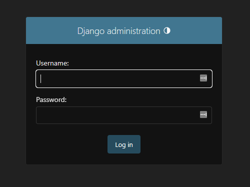


## User credentials
Although it is more secure to share credentials via a password manager such as LastPass (2023), for the purpose of testing this prototype, two sample users' login credentials has been included in the table below. Their (and other users') details can be modified (e.g. resetting passwords) in the backend database when logged in as the superuser, which was created in an earlier step. 

|    Username   |    Password   |  User (Employee) Type  |
|---------------|:-------------:|:----------------------:|
|  justin.thyme |    password   |       ISS Admin        |
|   sam.widge   |    password   |       NASA Admin       |


## User Interface
Navigate to `http://localhost:8000/` on a browser (e.g. Edge, Chrome). Below are screenshots of the ISS and NASA prototype website user interface. The following is an example for the ISS Admin user Justin Thyme (username: justin.thyme).

Log in page 
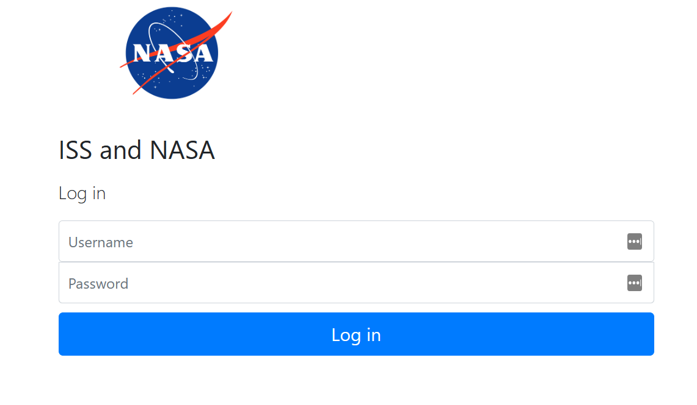

Logging in with username justin.thyme
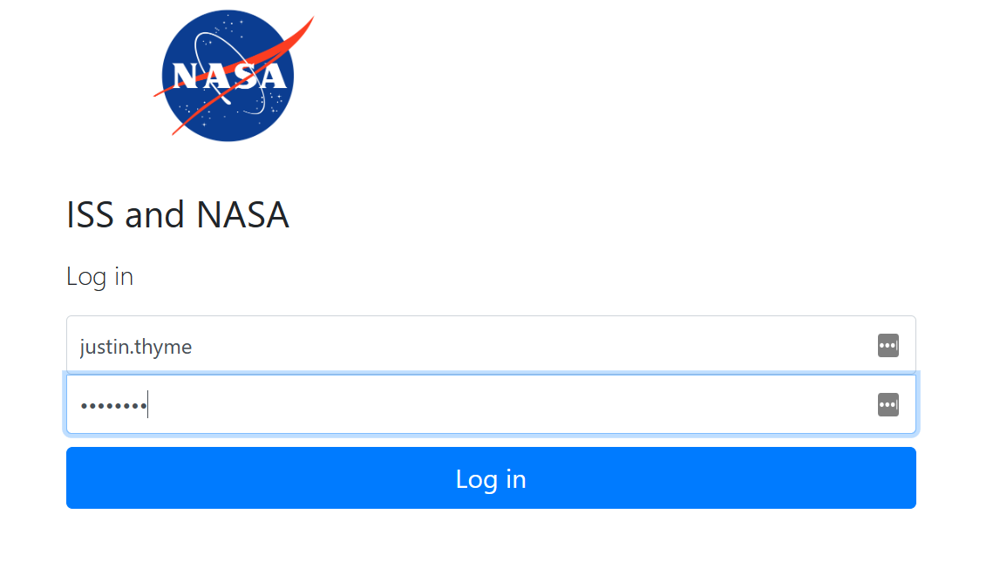

Home page view as an authenticated user (Justin Thyme) 
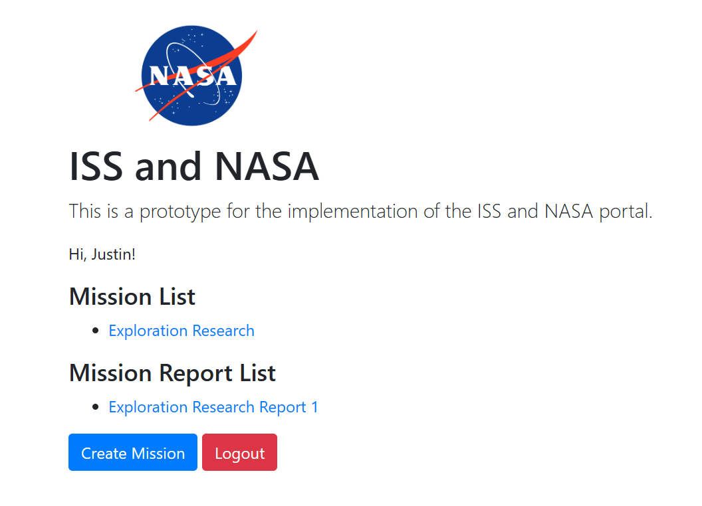

Create mission
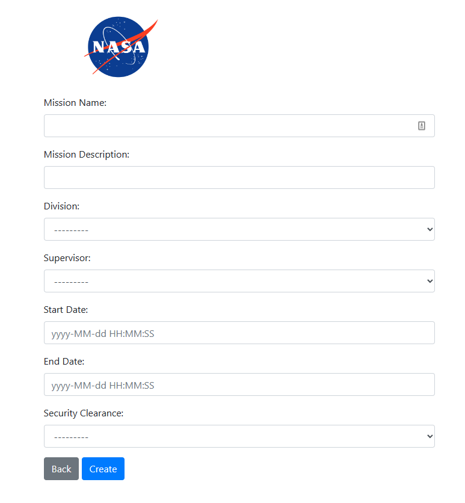

Manage mission and optional generate report
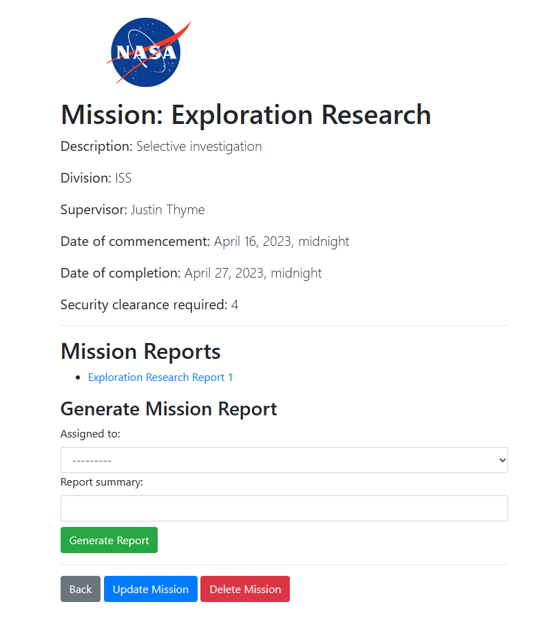

## Source code linter (Pylint)
The `pylint` linter is used to analyse the source code. This was installed with `requirements.txt`.

Output result of the `ssd2023` module by running the command `pylint ssd2023`:
```powershell
-------------------------------------------------------------------
Your code has been rated at 10.00/10 (previous run: 9.81/10, +0.19)
```

Output result of the `missions` module by running the command `pylint missions`:
```powershell
```

## Testing
To run the unit and integration tests:

PowerShell
```powershell
python manage.py test
```
Bash
```bash
python3 manage.py test
```

Output of the tests:
```powershell
Found 13 test(s).
Creating test database for alias 'default'...
System check identified no issues (0 silenced).
.............
----------------------------------------------------------------------
Ran 13 tests in 17.343s

OK
Destroying test database for alias 'default'...
```
## Security Features
This application was designed with security features (django, 2023) in mind. 

The following features come built-in with Django:

* SHA-256 encryption for passwords during login
* Salt and hashing for user authentication on login
* Session cookies 

The following commands were added to `settings.py` to achieve input santisation measures, session management, and data encryption:
```
# Content Security Policy
CSP_DEFAULT_SRC
CSP_STYLE_SRC
CSP_FONT_SRC
CSP_SCRIPT_SRC
CSP_IMG_SRC
CSP_FORM_ACTION
CSP_FRAME_ANCESTORS

# XSS protection
SECURE_BROWSER_XSS_FILTER

# X-Frame-Options
X_FRAME_OPTIONS

# X-Content-Type-Options
SECURE_CONTENT_TYPE_NOSNIFF

# SSL
SECURE_SSL_REDIRECT = False


# Cookie Security
CSRF_COOKIE_SECURE
CSRF_USE_SESSIONS
CSRF_COOKIE_HTTPONLY
LANGUAGE_COOKIE_HTTPONLY
SESSION_COOKIE_HTTPONLY
SESSION_COOKIE_SECURE
SESSION_COOKIE_SAMESITE

# HTTP Strict Transport Security
SECURE_HSTS_INCLUDE_SUBDOMAINS
SECURE_HSTS_SECONDS

# Logging
LOGGING
```

In addition, AES encryption of social security numbers was added with the django-encryption module.

The above were added to application based on attack reports generated by Zaproxy during automatic and mantual scanning techniques:

Intial Report
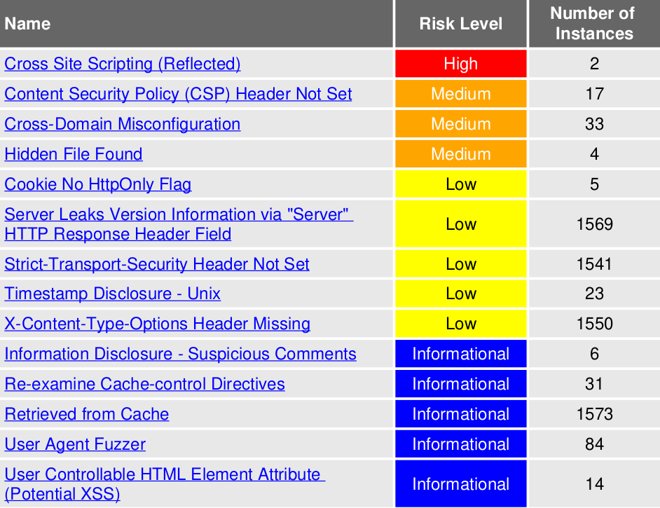

Final Report
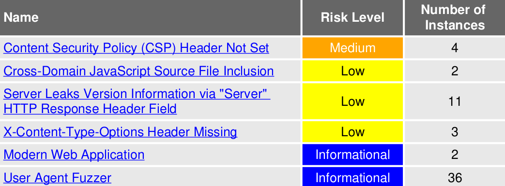

It should be noted that the security vulnerabilities found in the final report can be addressed by configuring the production server. please see the following documentation for assistance, if needed:

* CSP: https://developer.mozilla.org/en-US/docs/Web/HTTP/CSP (Mozilla, 2023)
* X-Content-Type-Options: https://developer.mozilla.org/en-US/docs/Web/HTTP/CSP (Webhint, n.d.)
* Server Leak: https://crashtest-security.com/server-version-fingerprinting/ (Kiprin, 2021)

The cross-domain URL has been neutralized using `integrity` and `crossorigin` modules, which can be seen in `base.html`.

### Access Controls

Access controls were handled by the admin (superuser) on the admin backend (see `http://localhost:8000/admin`) and comprised of:

Admin (superuser) permissions include but are not limited to:

* add and delete users
* edit users' statuses
* edit existing users
* create user groups
* add users to groups
* add and remove user permissions
* reset passwords

ISS Admin permissions
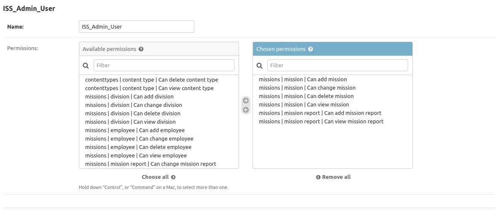

NASA Admin permissions
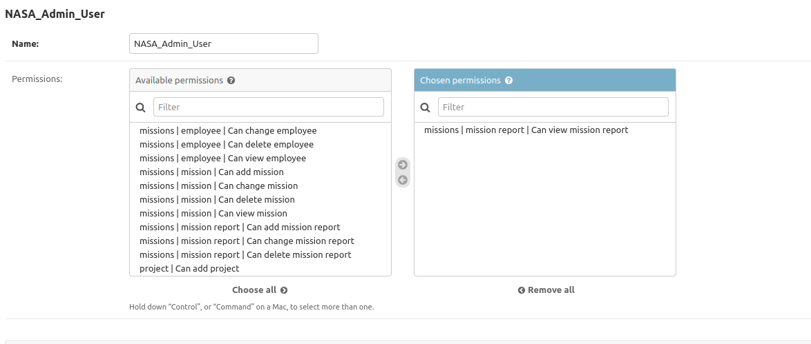

Mission Reports
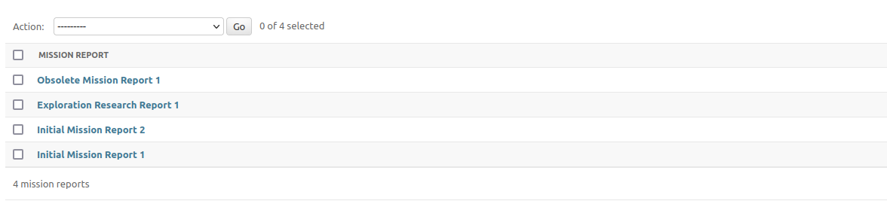

Permissions to view and generate reports can be demonstrated using the instructions in the _User Interface_ section.

## Differences Between the Prototype and Report Proposal (241 words)
Firstly, the use of Django in the prototype was not apart of the original proposal. It was later added to provide the most realistic prototype possible, and to allow for more enhanced vulnerability testing via Zaproxy which requires the use of a `host` .

Boundary validation was thus substituted for django in-built input validation modules, which can be reviewed in the _Security Features_ section above.

Multifactor Authentication (MFA) was included in the prospectus, but was not able to be included in the prototype due to time constraints. This will be added in the the production version of the application.

There are also differences between the class diagram and the classes ultimately written in `models.py`. The class diagram has the following classes:

* Report
* Satellite
* Project
* Mission
* Division
* Employee

While the prototype `models.py` has:

* Employee
* Division
* Mission
* MissionReport
* SecurityClearance

This prototype is meant to demonstrate the ISS Admin's ability to generate and send reports to the NASA Admin. As a result, satellite engineer and NASA employee classes were out of scope for this apect of this prototype.

As satellite data must be input by the ISS engineer, access to this data will be configured on the production server in the production version of the application.

Likewise, NASA employee access to report content will be added as needed in the production version of the application.

# References
* Django (2023) _Writing Your First Django App, Part 1_. Available at: https://docs.djangoproject.com/en/4.2/intro/tutorial01/
* Django (2023) _Working with Forms_ https://docs.djangoproject.com/en/4.1/topics/forms/
* Vincent, W. (2022) _Django Login and Logout Tutorial_ | LearnDjango. Available at: https://learndjango.com/tutorials/django-login-and-logout-tutorial
* Django (2023) _Security in Django_ https://docs.djangoproject.com/en/4.2/topics/security/
* LastPass (2023) _Password Management from Anywhere_. Available at: https://www.lastpass.com/
* Kiprin, B. (2021) _Web Server Information Leakage Security Assessment_ | CrashTest Security. Available at: https://crashtest-security.com/server-version-fingerprinting/
* Pypi (2023) _pylint 2.17.2_. Available at; https://pypi.org/project/pylint/
* Pypi (2022) _django-cryptography 1.1_. Available at: https://pypi.org/project/django-cryptography/
* Mozilla (2016) _Installing django-csp_. Available at: https://django-csp.readthedocs.io/en/latest/installation.html
* Mozilla (2023) _Content Security Policy_. Available at: https://developer.mozilla.org/en-US/docs/Web/HTTP/CSP
* Webhint (n.d.) _Use X-Content-Type-Options Header_ Available at: https://webhint.io/docs/user-guide/hints/hint-x-content-type-options/
* ZAP (2023) _Active Scan_. Available at: https://www.zaproxy.org/docs/desktop/start/features/ascan/
